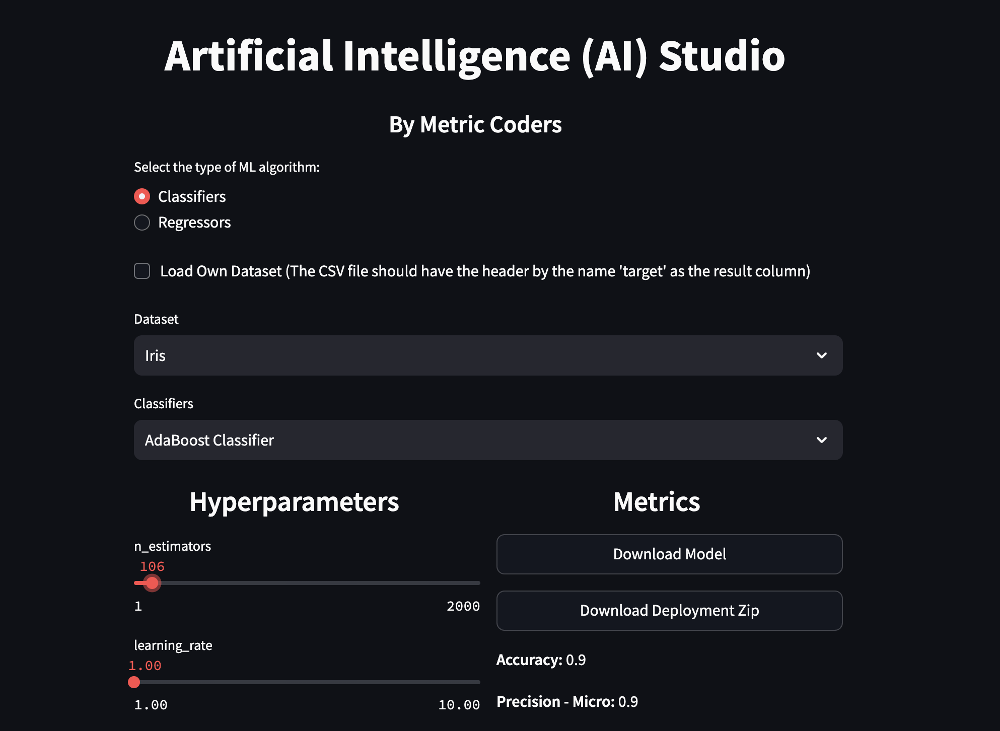
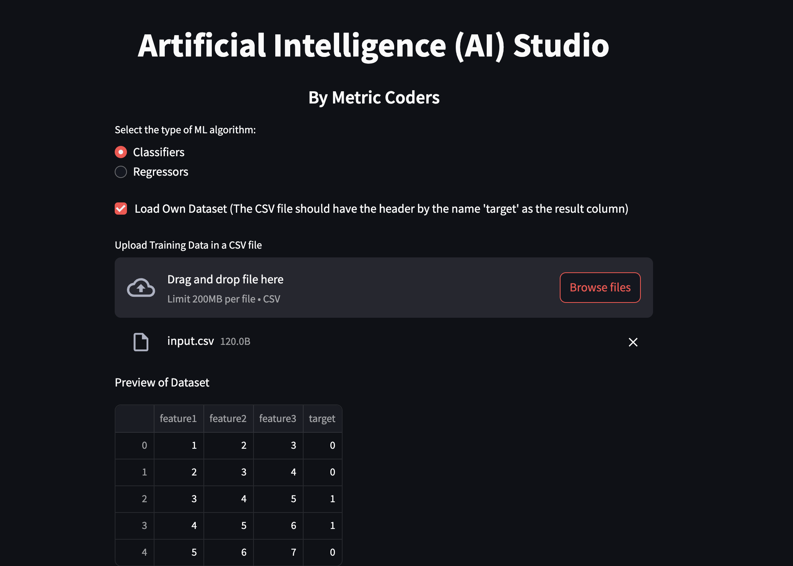

<p align="center">
  
</p>

<p align="center">
  <strong>The no-code software to train and deploy ML models, and eventually your AI SaaS</strong>
</p>

## Overview
**AI Studio** is a GitHub repository created by **Metric Coders**. It is a no-code software to create and train various machine learning (ML) models by configuring different hyperparameters through the UI. 

The platform is designed to simplify the process of building and experimenting with ML models, making it accessible for users with varying levels of expertise in machine learning. This application is built using **Streamlit** to provide an interactive and user-friendly experience.

The platform offers a **one-click deployment** zip file that contains everything you need to directly deploy the model as an API into your development and production environments.
## Homepage

Here is how the webpage looks when pre-trained datasets are loaded


Here is how the homepage looks when a custom dataset is loaded



## Features
### Current Features
- **Streamlit**: Users can easily create ML models using a graphical interface.
- **Hyperparameter Tuning**: Adjust and experiment with different hyperparameters to optimize model performance.
- **Preloaded Datasets**: Access to a variety of datasets provided by scikit-learn, facilitating immediate experimentation and learning.
- **Model Export**: Functionality to export trained models for deployment and further use.
- **Custom Datasets**: Users can upload and use their own datasets for model training.

### Upcoming Features
- **Data Cleaning and Preprocessing**: Tools for data cleaning and preprocessing will be integrated to prepare datasets for model training.
- **Support for LLMs**: Expansion to include large language models (LLMs), broadening the scope of the platform to natural language processing tasks.

## Getting Started
### Prerequisites
- Python 3.6+
- Scikit-learn library
- Streamlit

### Installation
1. Clone the repository:
    ```bash
    git clone https://github.com/MetricCoders/AI-Studio.git
    ```
2. Navigate to the project directory:
    ```bash
    cd AI-Studio
    ```
3. Install the required dependencies:
    ```bash
    pip install -r requirements.txt
    ```

### Running the Application
To start the Streamlit application, use the following command:
```bash
streamlit run Home.py
```
This will launch the AI Studio web UI. Open your web browser and navigate to the URL provided in the terminal to start using the platform.

## Usage
### Creating a Model
1. **Select a Dataset**: Choose from a variety of preloaded datasets or load your own datasets.
2. **Choose an Algorithm**: Select the machine learning algorithm you wish to use (e.g., linear regression, decision trees, etc.).
3. **Set Hyperparameters**: Configure the hyperparameters for your chosen algorithm.
4. **Train the Model**: Click the "Train" button to build and train your model.

### Evaluating a Model
After training, AI Studio provides performance metrics and visualizations to help you evaluate the effectiveness of your model. Use these insights to refine your model by adjusting hyperparameters or selecting different algorithms.

### Downloading the Trained Model
The "**Download Model**" button allows you to instantly download the model to your local directory.

### Downloading the Deployment Zip File
The "**Download Deployment Zip**" button allows you to instantly download a zip file that contains everything you need to run the model, including the model itself. It contains:
1. **backend_api.py**: This is full-fledged backend api written in fastapi that contains the complete code necessary to run the model in a development/production setup.
2. **model.joblib**: This is the trained model available to be used instantly in the production environment. This model is used by **backend_api.py** in order to make predictions.
3. **requirements.txt**: This is the requirements file required to run the backend_api.py correctly. The packages present in the requirements.txt file needs to installed in the following manner:

```bash
pip install -r requirements.txt
```

### Loading Own Datasets
The datasets should have headers and the column by the name 'target' should contain the output/result. A sample is given below:

feature1,feature2,feature3,target

1,2,3,0

2,3,4,0

3,4,5,1

4,5,6,1

5,6,7,0

6,7,8,1

7,8,9,0

8,9,10,1

9,10,11,1

10,11,12,0


## License
This project is licensed under the MIT License. See the `LICENSE` file for details.

## Contact
For questions, feedback, or support, please contact me via email at info@metriccoders.com.

---

**AI Studio by Metric Coders** aims to democratize machine learning by providing an intuitive platform for model creation and experimentation. With upcoming features and continuous improvements, it strives to be a comprehensive tool for both novice and experienced data scientists.
